# BVH Acceleration Structure — Deep Dive

This document explains every step of how `BvhAggregate` builds, stores, and traverses a
Bounding Volume Hierarchy (BVH). It follows the implementation in
`src/accelerators/BvhAggregate.cpp` and its header
`src/accelerators/include/BvhAggregate.hpp`.

The explanation is ordered so that the **geometry and mathematics** of each concept come
first, followed immediately by the code that implements it. You should never encounter a
code snippet whose purpose is not already grounded in the math above it.

---

## Table of Contents

1. [Axis-Aligned Bounding Boxes — the Geometric Primitive](#1-axis-aligned-bounding-boxes--the-geometric-primitive)
2. [What Is a BVH? — the Tree Idea](#2-what-is-a-bvh--the-tree-idea)
3. [Ray–AABB Intersection — the Slab Method](#3-rayaabb-intersection--the-slab-method)
4. [The Build Problem — What Makes a Good Tree?](#4-the-build-problem--what-makes-a-good-tree)
5. [Surface Area Heuristic — the Cost Model](#5-surface-area-heuristic--the-cost-model)
6. [Bucket-Based SAH — the Approximation](#6-bucket-based-sah--the-approximation)
7. [Architecture Overview — Two-Phase Build](#7-architecture-overview--two-phase-build)
8. [Data Structures](#8-data-structures)
   - [IPrimitive — the leaf unit](#iprimitive--the-leaf-unit)
   - [BVHPrimitive — the build wrapper](#bvhprimitive--the-build-wrapper)
   - [BVHBuildNode — the tree node](#bvhbuildnode--the-tree-node)
   - [LinearBVHNode — the traversal node](#linearbvhnode--the-traversal-node)
   - [BucketInfo, SplitPredicate, CentroidAxisLess](#bucketinfo-splitpredicate-centroidaxisless)
9. [Phase 1 — Building the Tree](#9-phase-1--building-the-tree)
   - [Constructor entry point](#constructor-entry-point)
   - [buildRecursive](#buildrecursive)
   - [determineSplit — choosing the axis and invoking SAH](#determinesplit--choosing-the-axis-and-invoking-sah)
   - [computeSAHSplit — the full SAH pipeline in code](#computesahsplit--the-full-sah-pipeline-in-code)
   - [Partitioning — reordering the primitive array](#partitioning--reordering-the-primitive-array)
   - [buildLeaf](#buildleaf)
10. [Phase 2 — Flattening the Tree](#10-phase-2--flattening-the-tree)
11. [Traversal](#11-traversal)
    - [Ray setup](#ray-setup)
    - [intersect / traverseForHit](#intersect--traverseforhit)
    - [intersectP / traverseForAnyHit](#intersectp--traverseforanyhit)
12. [Memory Model and RAII](#12-memory-model-and-raii)
13. [Complete Call Graph](#13-complete-call-graph)

---

## 1. Axis-Aligned Bounding Boxes — the Geometric Primitive

The elementary building block of the entire BVH is the **Axis-Aligned Bounding Box
(AABB)**. An AABB is the smallest box, with sides parallel to the coordinate axes, that
completely encloses a given set of points or geometry.

It is defined by two corner points:

```
pMin = (x_min, y_min, z_min)
pMax = (x_max, y_max, z_max)
```

All points P inside the box satisfy:

```
x_min ≤ P.x ≤ x_max
y_min ≤ P.y ≤ y_max
z_min ≤ P.z ≤ z_max
```

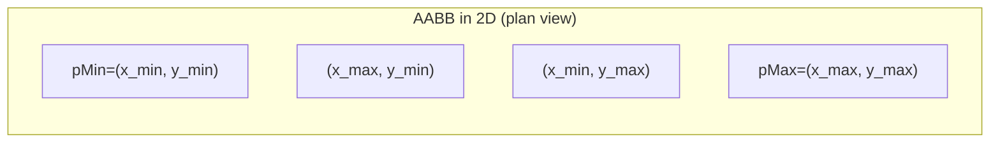

The AABB has three important geometric properties used throughout the BVH:

| Property | Formula | Used for |
|----------|---------|---------|
| **Diagonal** | `d = pMax − pMin` | Length along each axis |
| **Surface area** | `SA = 2(d.x·d.y + d.x·d.z + d.y·d.z)` | SAH cost model |
| **Centroid** | `c = (pMin + pMax) / 2` | Bucket assignment during build |
| **Max dimension** | `axis = argmax(d.x, d.y, d.z)` | Choosing split axis |

In code (`src/maths/include/Bounds3.tpp`):

```cpp
template <typename T> T Bounds3<T>::surfaceArea() const
{
    Vector3<T> d = diagonal();
    return 2 * ((d.x() * d.y()) + (d.x() * d.z()) + (d.y() * d.z()));
}

template <typename T> Point3<T> Bounds3<T>::centroid() const
{
    return pMin + (pMax - pMin) / static_cast<T>(2);
}

template <typename T> int Bounds3<T>::maxDimension() const
{
    Vector3<T> d = diagonal();
    if (d.x() > d.y() && d.x() > d.z()) return 0;
    if (d.y() > d.z()) return 1;
    return 2;
}
```

The **union** of two AABBs is the smallest AABB containing both. It is computed
component-wise:

```
union(A, B).pMin = (min(A.x_min, B.x_min), min(A.y_min, B.y_min), min(A.z_min, B.z_min))
union(A, B).pMax = (max(A.x_max, B.x_max), max(A.y_max, B.y_max), max(A.z_max, B.z_max))
```

```cpp
template <typename T>
Bounds3<T> Bounds3<T>::boundsUnion(const Bounds3<T> &other) const
{
    return Bounds3<T>(
        Point3<T>(min(pMin.x(), other.pMin.x()), ...),
        Point3<T>(max(pMax.x(), other.pMax.x()), ...));
}
```

---

## 2. What Is a BVH? — the Tree Idea

### The brute-force problem

Suppose a scene has **n** primitives. To render one pixel, a ray must be tested against
every primitive. With many pixels and many bounces, this is O(n) per ray — unacceptably
slow for large scenes.

### Hierarchical culling

A BVH organises primitives into a binary tree. Every **interior node** stores an AABB
that is the **union** of all AABBs in its subtree. When a ray misses an interior node's
AABB, the **entire subtree is skipped** — potentially hundreds or thousands of primitives
dismissed with a single cheap box test.

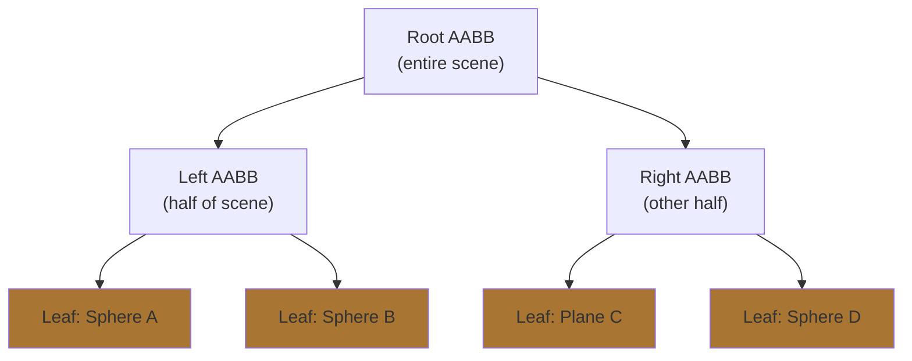

### Geometric invariant

Every interior node's AABB **contains** the AABBs of both its children:

```
AABB(parent) = union(AABB(left_child), AABB(right_child))
```

This means: if a ray misses the parent, it cannot possibly hit anything inside either
child. Conversely, if a ray hits the parent, it *might* hit something inside — but we
still need to test the children.

### Complexity

For a balanced tree with n leaves, the depth is `log₂(n)`. In the best case, at each
level the ray eliminates one entire branch. The expected number of box tests is
O(log n), and the expected number of actual primitive intersections is O(1) for
well-distributed geometry. In the worst case (all geometry in a line, ray parallel to
that line), it degrades to O(n).

### The key design choice: what is a leaf?

The parameter `maxPrimsInNode` controls when recursion stops. With `maxPrimsInNode = 1`,
every leaf holds exactly one primitive. With larger values, some leaves hold small groups.
The default in this implementation is `1`.

---

## 3. Ray–AABB Intersection — the Slab Method

### Geometric intuition

A box can be seen as the intersection of three infinite **slabs** — one per axis. A slab
is the region between two parallel planes. For the x-axis, the slab is:

```
x_min ≤ P.x ≤ x_max
```

A ray hits the box if and only if it hits **all three slabs simultaneously**.

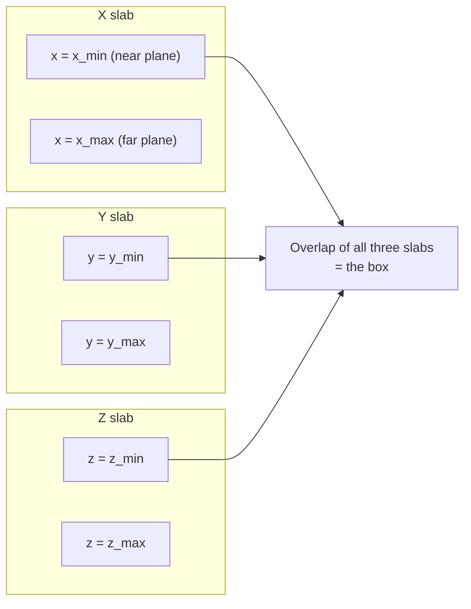

### Mathematical derivation

A ray is the parametric function:

```
P(t) = O + t · D
```

where `O` is the origin, `D` is the direction, and `t ≥ 0`.

For axis `i`, the ray enters the slab at parameter `t_near_i` and exits at `t_far_i`:

```
t_near_i = (pMin_i − O_i) / D_i
t_far_i  = (pMax_i − O_i) / D_i
```

If `D_i < 0`, the ray travels in the negative direction so `t_near_i > t_far_i`. We swap
them so `t_near_i` is always the smaller value.

After processing all three axes, the ray's **entry** into the box is:

```
t_enter = max(t_near_x, t_near_y, t_near_z)
```

And the **exit** is:

```
t_exit = min(t_far_x, t_far_y, t_far_z)
```

The ray hits the box if and only if:

```
t_enter < t_exit    AND    t_exit > 0    AND    t_enter < ray.tMax
```

- `t_enter < t_exit`: the entry happens before the exit (the slabs overlap)
- `t_exit > 0`: the box is not entirely behind the ray origin
- `t_enter < ray.tMax`: the box is not beyond an already-known closer hit

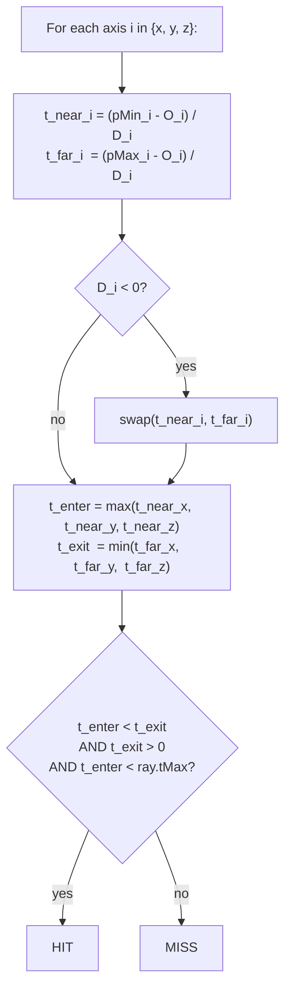

### Optimised form — precomputed `invDir` and `dirIsNeg`

Division is expensive. Since the same ray tests hundreds of boxes during traversal, the
direction is inverted **once** before traversal starts:

```
invDir = (1/D.x, 1/D.y, 1/D.z)
```

Then every division becomes a multiplication:

```
t_near_i = (pMin_i − O_i) * invDir_i
t_far_i  = (pMax_i − O_i) * invDir_i
```

The sign check `D_i < 0` is equivalent to `invDir_i < 0`, so it too is precomputed once:

```
dirIsNeg[i] = (invDir_i < 0) ? 1 : 0
```

When `dirIsNeg[i] == 1`, `pMax_i` gives the **near** entry and `pMin_i` gives the **far**
exit. The slab test then reads `bounds[dirIsNeg[i]]` for the near plane and
`bounds[1 − dirIsNeg[i]]` for the far plane — no branch needed.

In code (`src/maths/include/Bounds3.tpp:144-177`):

```cpp
bool Bounds3<T>::intersectP(const Ray &ray, const Vector3<T> &invDir,
    const std::array<int, 3> &dirIsNeg) const
{
    int i    = dirIsNeg[0];
    T txMin  = (bounds[i].x()   - ray.origin.x()) * invDir.x();
    T txMax  = (bounds[1-i].x() - ray.origin.x()) * invDir.x();

    i        = dirIsNeg[1];
    T tyMin  = (bounds[i].y()   - ray.origin.y()) * invDir.y();
    T tyMax  = (bounds[1-i].y() - ray.origin.y()) * invDir.y();

    if ((txMin > tyMax) || (tyMin > txMax)) return false;
    if (tyMin > txMin) txMin = tyMin;
    if (tyMax < txMax) txMax = tyMax;

    i        = dirIsNeg[2];
    T tzMin  = (bounds[i].z()   - ray.origin.z()) * invDir.z();
    T tzMax  = (bounds[1-i].z() - ray.origin.z()) * invDir.z();

    if ((txMin > tzMax) || (tzMin > txMax)) return false;
    // ...
    return (txMin < ray.tMax) && (txMax > static_cast<T>(0));
}
```

---

## 4. The Build Problem — What Makes a Good Tree?

Building a BVH is a tree construction problem: given n primitives, partition them
recursively into two groups until groups are small enough to be leaves.

The question is: **how do we choose the partition?**

### A bad split — equal counts

The simplest idea is to split primitives into two groups of equal size. This produces a
balanced tree (depth exactly `log₂(n)`), but it ignores the geometry. Consider 99
spheres clustered in one corner and one sphere elsewhere. Splitting 50/50 puts the lone
sphere in a leaf whose bounding box spans most of the scene — any ray aimed at the
cluster must still test that large box.

### A better split — spatial median

Split along the midpoint of the longest axis of the group's bounding box. This tends to
separate spatially distinct groups, but it can still fail when primitives are skewed
(many on one side of the median, few on the other).

### The optimal split — minimise expected traversal cost

The ideal split minimises the **expected number of ray–primitive intersection tests** over
all possible rays. This is what the Surface Area Heuristic formalises.

---

## 5. Surface Area Heuristic — the Cost Model

### Geometric probability

The SAH is built on one elegant geometric fact: for a uniformly distributed set of rays,
the **probability that a ray hits a convex body A given that it already hits a convex
body B** (where `A ⊆ B`) is:

```
P(ray hits A | ray hits B) = SA(A) / SA(B)
```

where `SA(X)` denotes the surface area of the convex hull of `X`. This is the
**Buffon–Sylvester theorem** applied to random line intersections.

Intuitively: the larger the surface a body presents relative to its container, the more
likely a random ray will hit it.

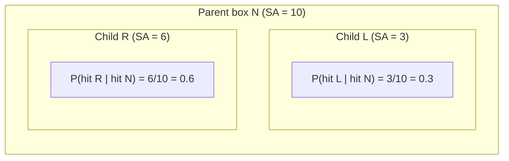

### The cost function

Let `N` be a BVH node containing `n` primitives with bounding box of surface area `SA(N)`.
Suppose we split `N` into a left child `L` with `n_L` primitives and a right child `R`
with `n_R` primitives. We assign two costs:

- `t_trav`: cost of testing a ray against one AABB (the interior node box test)
- `t_isect`: cost of testing a ray against one primitive

The expected cost of tracing a ray through this split is:

```
C(split) = t_trav + P(hit L | hit N) · n_L · t_isect + P(hit R | hit N) · n_R · t_isect
```

Substituting the geometric probability:

```
C(split) = t_trav + (SA(L) / SA(N)) · n_L · t_isect + (SA(R) / SA(N)) · n_R · t_isect
```

Setting `t_trav = 1` and `t_isect = 1` (they are relative costs; the ratio is what
matters):

```
C(split) = 1 + (SA(L) · n_L + SA(R) · n_R) / SA(N)
```

The cost of **not splitting** (making a leaf directly) is:

```
C(leaf) = n   (one intersection test per primitive, no box test overhead)
```

The split is only performed if `C(split) < C(leaf)`. Otherwise, creating a leaf is
cheaper.

This is exactly what the code computes and checks:

```cpp
// computeSAHCosts — the cost formula
cost[i] = 1.0 + (sa0 * c0 + sa1 * c1) / parentSA;

// computeSAHSplit — the leaf vs. split decision
if (costs[minSplit] >= static_cast<double>(end - start))
    return -1;  // leaf is cheaper; signal buildRecursive to call buildLeaf
```

### Visual intuition

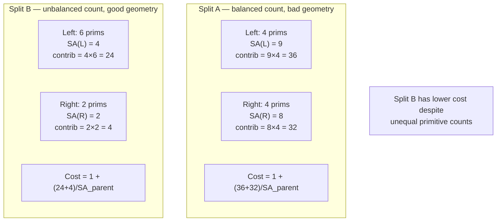

This illustrates why SAH is superior to equal-count splitting: a spatially tight group
of 6 primitives can be cheaper than a loose group of 4.

---

## 6. Bucket-Based SAH — the Approximation

### The continuous optimisation problem

In principle, a split plane can be placed at any position along the chosen axis. We want:

```
argmin_{t ∈ [x_min, x_max]}  C(t)
```

where `C(t)` is the SAH cost of splitting at position `t`. This is a continuous
optimisation problem. Evaluating `C(t)` exactly requires knowing which primitives fall
left and right of `t`, which changes every time `t` crosses a centroid.

Computing the exact optimal split would require sorting all primitives by centroid and
evaluating the cost at each of the `n−1` possible split positions — O(n log n) work per
node.

### Discretisation into buckets

The bucket approach approximates the continuous problem by dividing the centroid range
into `k` equal-width intervals called **buckets**, and only evaluating the `k−1` split
planes between adjacent buckets. This implementation uses `k = 12`.

```
lo  = centroid_bounds.pMin[axis]
hi  = centroid_bounds.pMax[axis]
width = (hi - lo) / k
```

Bucket index for a primitive `p`:

```
bucket(p) = floor( k · (centroid(p)[axis] − lo) / (hi − lo) )
```

clamped to `[0, k−1]`.

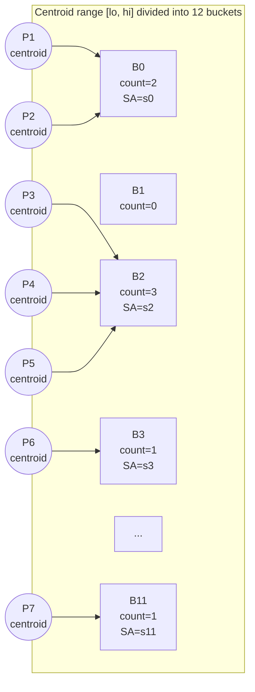

### Evaluating all k−1 split planes

For each candidate split plane `i` (between bucket `i` and bucket `i+1`):

- **Left partition** = buckets `0` through `i` — accumulate their union bounds and total count
- **Right partition** = buckets `i+1` through `k−1` — same

```
SA(L_i) = surfaceArea( union of bounds of buckets 0..i )
n_L_i   = sum of counts of buckets 0..i

SA(R_i) = surfaceArea( union of bounds of buckets (i+1)..(k-1) )
n_R_i   = sum of counts of buckets (i+1)..(k-1)

Cost(i) = 1 + (SA(L_i) · n_L_i + SA(R_i) · n_R_i) / SA(parent)
```

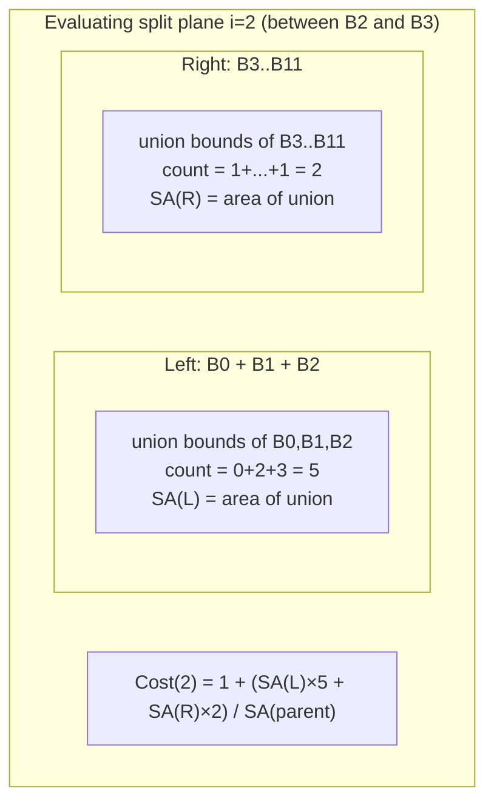

After computing all 11 costs, we pick the minimum. If that minimum cost exceeds `n` (the
leaf cost), we create a leaf instead.

### Why use centroid bounds, not primitive bounds?

The bucket discretisation maps centroid positions to bucket indices. Using the full
primitive bounds (`pMin` to `pMax`) would give a range that extends beyond all centroids
— the outermost fractions of that range would always be empty, wasting bucket resolution
on dead space. The **centroid bounds** (the AABB of all centroid points) ensures the full
bucket range is occupied.

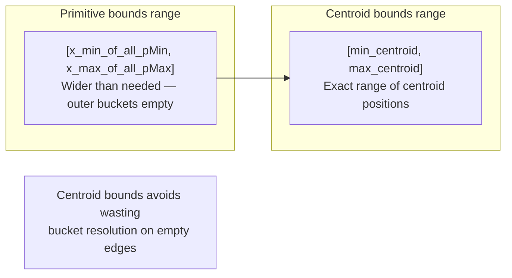

---

## 7. Architecture Overview — Two-Phase Build

`BvhAggregate` uses a **two-phase build**:

| Phase | Data structure | Purpose |
|-------|---------------|---------|
| Phase 1 | `std::deque<BVHBuildNode>` | Build a recursive tree in memory |
| Phase 2 | `std::unique_ptr<LinearBVHNode[]>` | Flatten the tree into a cache-friendly linear array |

The tree is discarded after flattening. Only the flat array survives into traversal.

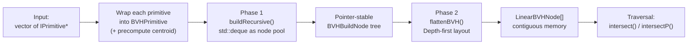

---

## 8. Data Structures

### IPrimitive — the leaf unit

Defined in `src/shapes/include/IPrimitive.hpp`.

```cpp
class IPrimitive {
public:
    virtual std::optional<SurfaceInteraction> intersect(const maths::Ray &) const = 0;
    virtual bool intersectP(const maths::Ray &) const = 0;
    virtual maths::Bounds3<> worldBound() const = 0;
    virtual const material::IMaterial *material() const = 0;
};
```

Any concrete shape (`GeometricPrimitive` wrapping a `Sphere` or `Plane`) implements this
interface. `BvhAggregate` itself also implements `IPrimitive`, meaning a BVH can be
nested inside another BVH.

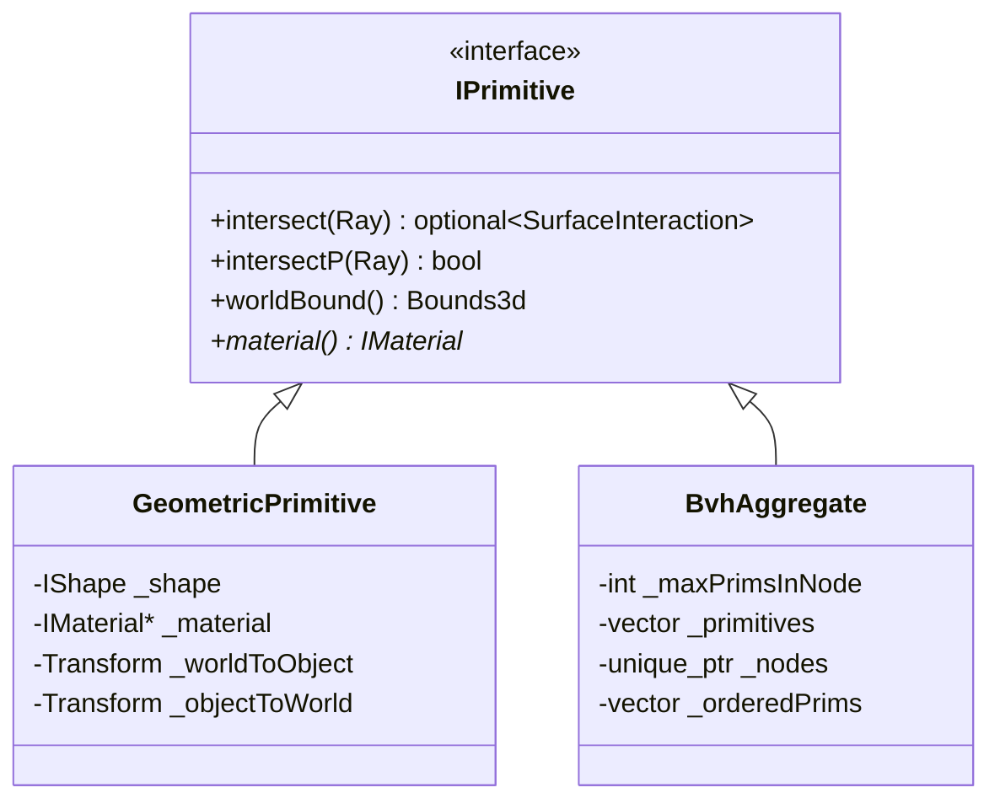

---

### BVHPrimitive — the build wrapper

`BVHPrimitive` is a **temporary, build-only** struct. It wraps an `IPrimitive` index
together with its precomputed bounding box and centroid. The centroid is computed once at
construction and reused every time a bucket index is computed during SAH evaluation —
avoiding repeated calls to `worldBound().centroid()`.

```cpp
// BvhAggregate.hpp (private)
struct BVHPrimitive {
    BVHPrimitive(size_t primitiveIndex, const maths::Bounds3d &bounds);
    size_t primitiveIndex;
    maths::Bounds3d bounds;
    maths::Point3d centroid;
};
```

```cpp
// BvhAggregate.cpp
BvhAggregate::BVHPrimitive::BVHPrimitive(size_t idx, const maths::Bounds3d &b):
    primitiveIndex(idx), bounds(b), centroid(b.centroid())
{}
```

| Field | Type | Meaning |
|-------|------|---------|
| `primitiveIndex` | `size_t` | Index into `_primitives` (the owner vector) |
| `bounds` | `Bounds3d` | World-space AABB — used to compute node and bucket bounds |
| `centroid` | `Point3d` | `(pMin + pMax) / 2` — used for axis selection and bucket assignment |

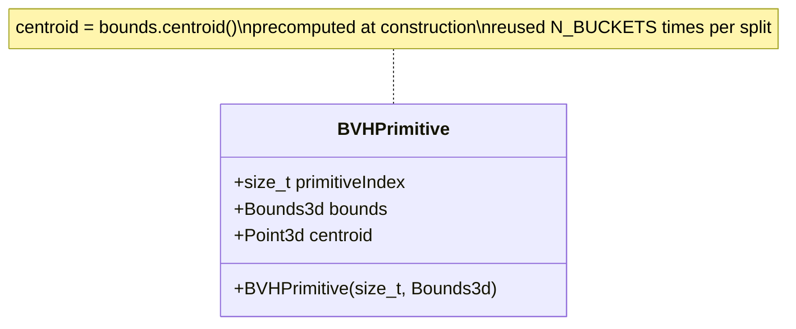

---

### BVHBuildNode — the tree node

`BVHBuildNode` represents a node in the **temporary** recursive tree built during
Phase 1. The type encodes two states — leaf and interior — using one flag: `nPrimitives`.

```cpp
struct BVHBuildNode {
    void initLeaf(int firstPrimOffset, int nPrimitives, const maths::Bounds3d &b);
    void initInterior(int splitAxis, BVHBuildNode *left, BVHBuildNode *right);

    maths::Bounds3d bounds;
    BVHBuildNode *children[2] = {nullptr, nullptr};
    int splitAxis             = 0;
    int firstPrimOffset       = 0;
    int nPrimitives           = 0;
};
```

| `nPrimitives` | Node type | Relevant fields |
|---------------|-----------|----------------|
| `> 0` | Leaf | `bounds`, `firstPrimOffset`, `nPrimitives` |
| `== 0` | Interior | `bounds`, `splitAxis`, `children[0]`, `children[1]` |

`initInterior` computes the parent bounds as the **union** of both children. This is
automatic — the parent AABB is never stored explicitly during build; it is derived from
the children as the recursion unwinds:

```cpp
void BvhAggregate::BVHBuildNode::initInterior(
    int axis, BVHBuildNode *left, BVHBuildNode *right)
{
    splitAxis   = axis;
    children[0] = left;
    children[1] = right;
    bounds      = left->bounds.boundsUnion(right->bounds);  // union bubbles up
    nPrimitives = 0;
}
```

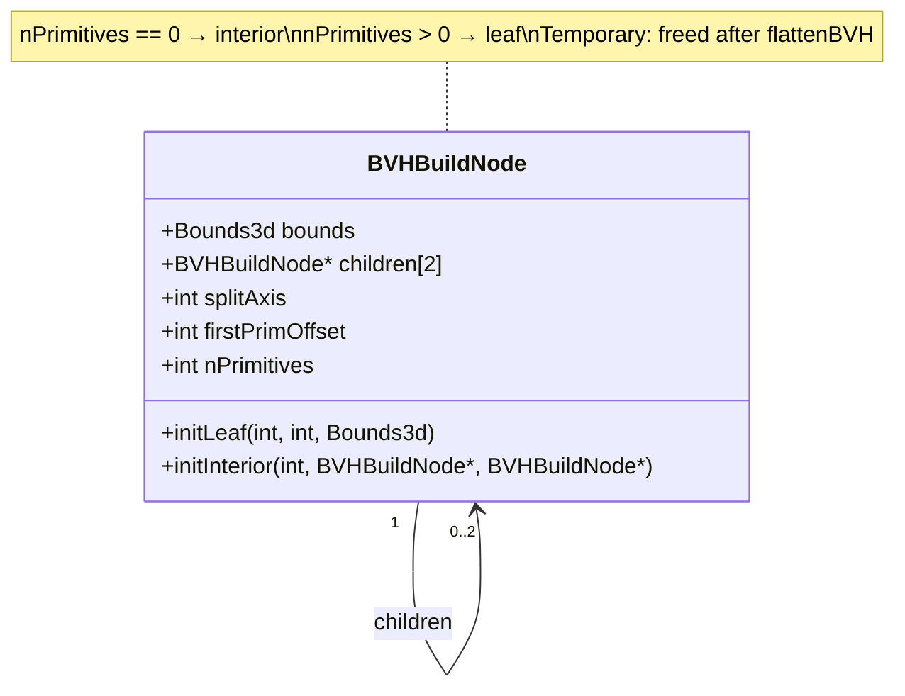

---

### LinearBVHNode — the traversal node

`LinearBVHNode` is the **runtime** node used during traversal. The entire tree lives in a
single contiguous array `_nodes[]`. The `alignas(32)` directive ensures each 32-byte node
fits in one CPU cache line, so touching one field of a node loads the entire node at once.

```cpp
struct alignas(32) LinearBVHNode {
    maths::Bounds3d bounds;
    union {
        int primitivesOffset;   // leaf: first index into _orderedPrims
        int secondChildOffset;  // interior: index of right child in _nodes[]
    };
    uint16_t nPrimitives;  // 0 = interior
    uint8_t  axis;         // split axis (interior only)
};
```

The `union` carries different meanings depending on `nPrimitives`:

| `nPrimitives` | Union field used | Meaning |
|---------------|-----------------|---------|
| `> 0` (leaf) | `primitivesOffset` | First index into `_orderedPrims` |
| `0` (interior) | `secondChildOffset` | Absolute index of right child in `_nodes[]` |

The left child of an interior node is **always** at `index + 1` in the array — a
depth-first layout guarantee explained in Phase 2.

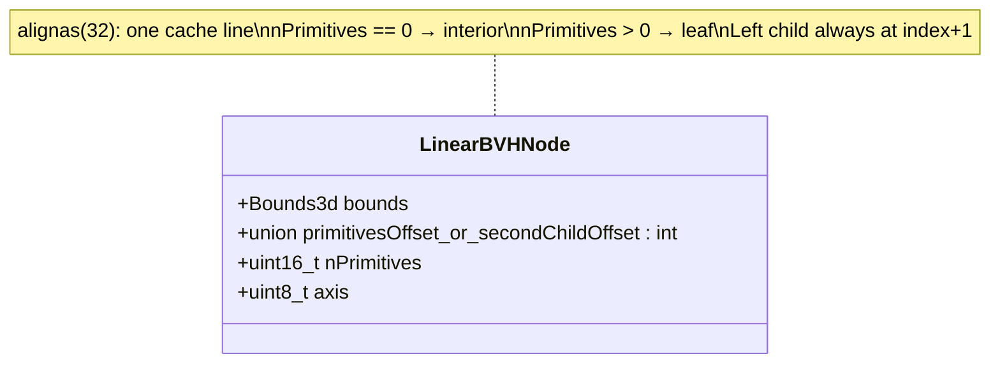

---

### BucketInfo, SplitPredicate, CentroidAxisLess

Three helper types used only during SAH splitting:

```cpp
struct BucketInfo {
    int count = 0;
    maths::Bounds3d bounds;
    bool initialized = false;
};

struct SplitPredicate {
    int axis;
    double splitPos;
    bool operator()(const BVHPrimitive &p) const;
};

struct CentroidAxisLess {
    int axis;
    bool operator()(const BVHPrimitive &a, const BVHPrimitive &b) const;
};
```

| Type | Role |
|------|------|
| `BucketInfo` | Accumulates bounds and primitive count for one SAH bucket |
| `SplitPredicate` | Passed to `std::partition`; returns true if centroid is left of the split plane |
| `CentroidAxisLess` | Passed to `std::nth_element` as a fallback median comparator |

The `initialized` flag in `BucketInfo` is necessary because `Bounds3d`'s default
constructor produces an **inside-out** box (`pMin = +∞, pMax = −∞`). Unioning any real
box with an inside-out box gives the real box — which is actually correct — but counting
`count > 0` in the accumulator when `initialized == false` would produce a wrong surface
area. The flag ensures the first real bounds replaces the default rather than unions with
garbage.

---

## 9. Phase 1 — Building the Tree

### Constructor entry point

```cpp
// BvhAggregate.cpp:16-35
BvhAggregate::BvhAggregate(
    std::vector<std::unique_ptr<IPrimitive>> primitives, int maxPrimsInNode):
    _maxPrimsInNode{maxPrimsInNode}, _primitives{std::move(primitives)}
{
    if (_primitives.empty())
        return;
    std::vector<BVHPrimitive> bvhPrimitives;
    bvhPrimitives.reserve(_primitives.size());
    for (size_t i = 0; i < _primitives.size(); ++i)
        bvhPrimitives.emplace_back(i, _primitives[i]->worldBound());
    std::deque<BVHBuildNode> nodePool;
    std::vector<IPrimitive *> orderedPrims;
    orderedPrims.reserve(_primitives.size());
    BVHBuildNode *root = buildRecursive(nodePool, bvhPrimitives, 0,
        static_cast<int>(bvhPrimitives.size()), orderedPrims);
    _nodes             = std::make_unique<LinearBVHNode[]>(nodePool.size());
    int offset         = 0;
    flattenBVH(root, &offset);
    _orderedPrims = std::move(orderedPrims);
}
```

**Why `std::deque` as a node pool?**

`buildRecursive` grows the pool by calling `nodePool.emplace_back()` and immediately
takes a raw pointer to that element (`&nodePool.back()`). The pointer must remain valid
for the entire duration of the build — the same node is pointed to by its parent, which
might be created thousands of calls later. `std::vector` would invalidate all existing
pointers on reallocation. `std::deque` never relocates existing elements on
`emplace_back`, so all previously returned pointers stay valid.

**`orderedPrims` — the leaf-order array**

As `buildLeaf` runs, it appends primitive pointers to `orderedPrims` in their final
traversal order. Each leaf records its `firstPrimOffset` (start index in `orderedPrims`)
and `nPrimitives` (count). After the build, this array becomes `_orderedPrims` — a flat,
dense array indexed by leaf nodes during traversal.

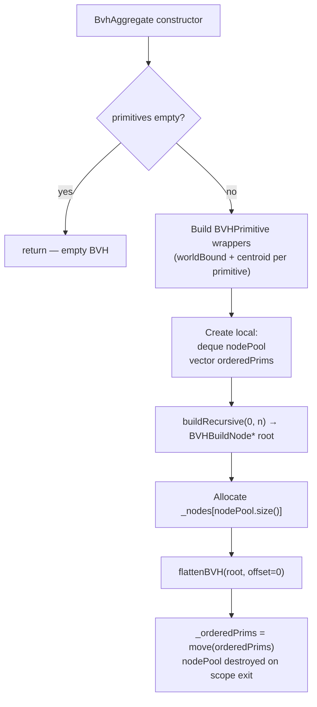

---

### buildRecursive

`buildRecursive` operates on a **contiguous sub-range** `[start, end)` of the
`bvhPrimitives` array. The array is reordered in place (by `partitionPrims`) so that
after a split, `[start, mid)` holds the left group and `[mid, end)` holds the right.

```cpp
// BvhAggregate.cpp:93-110
BvhAggregate::BVHBuildNode *BvhAggregate::buildRecursive(
    std::deque<BVHBuildNode> &nodePool,
    std::vector<BVHPrimitive> &bvhPrimitives, int start, int end,
    std::vector<IPrimitive *> &orderedPrims)
{
    nodePool.emplace_back();
    BVHBuildNode *node     = &nodePool.back();
    maths::Bounds3d bounds = computePrimBounds(bvhPrimitives, start, end);
    if (end - start <= _maxPrimsInNode)
        return buildLeaf(node, bounds, bvhPrimitives, start, end, orderedPrims);
    auto [axis, mid] = determineSplit(bvhPrimitives, start, end, bounds);
    if (mid < 0)
        return buildLeaf(node, bounds, bvhPrimitives, start, end, orderedPrims);
    node->initInterior(axis,
        buildRecursive(nodePool, bvhPrimitives, start, mid, orderedPrims),
        buildRecursive(nodePool, bvhPrimitives, mid, end, orderedPrims));
    return node;
}
```

`computePrimBounds` sweeps the range to union all bounding boxes:

```cpp
maths::Bounds3d BvhAggregate::computePrimBounds(
    const std::vector<BVHPrimitive> &bvhPrimitives, int start, int end)
{
    maths::Bounds3d bounds = bvhPrimitives[start].bounds;
    for (int i = start + 1; i < end; ++i)
        bounds = bounds.boundsUnion(bvhPrimitives[i].bounds);
    return bounds;
}
```

| Condition | Action |
|-----------|--------|
| `end − start ≤ maxPrimsInNode` | Leaf immediately — group is small enough |
| `mid < 0` from `determineSplit` | Leaf — either all centroids coincide, or SAH says leaf is cheaper |
| Otherwise | Interior node — recurse on left and right |

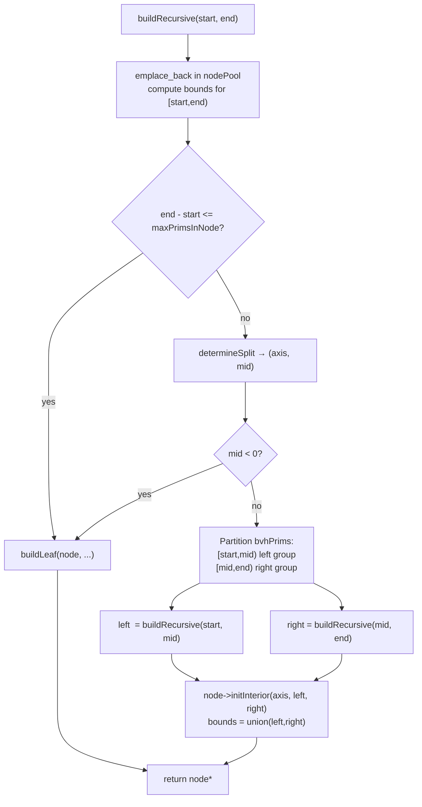

---

### determineSplit — choosing the axis and invoking SAH

```cpp
std::pair<int, int> BvhAggregate::determineSplit(
    std::vector<BVHPrimitive> &bvhPrimitives, int start, int end,
    const maths::Bounds3d &bounds)
{
    maths::Bounds3d cb = computeCentroidBounds(bvhPrimitives, start, end);
    int axis = cb.maxDimension();
    if (cb.pMin.data()[axis] == cb.pMax.data()[axis])
        return {axis, -1};
    return {axis, computeSAHSplit(bvhPrimitives, start, end, bounds, cb, axis)};
}
```

**Step 1 — centroid bounds:** sweep all centroids in `[start, end)` to find the smallest
AABB that contains them all.

```cpp
maths::Bounds3d BvhAggregate::computeCentroidBounds(
    const std::vector<BVHPrimitive> &bvhPrimitives, int start, int end)
{
    maths::Bounds3d cb{bvhPrimitives[start].centroid};
    for (int i = start + 1; i < end; ++i)
        cb = cb.boundsUnion(bvhPrimitives[i].centroid);
    return cb;
}
```

`Bounds3d(Point3d)` initialises `pMin = pMax = p`, creating a zero-volume box at the
first centroid. Each `boundsUnion` expands it to include the next centroid.

**Step 2 — axis selection:** the axis along which centroids are most spread out
(`maxDimension()` returns the index of the longest diagonal component). Splitting along
the most spread axis tends to produce children with smaller bounding boxes.

**Step 3 — degenerate check:** if all centroids are identical on that axis
(`cb.pMin[axis] == cb.pMax[axis]`), no split plane can separate any two primitives — all
bucket indices would be the same. Return `mid = -1` to force a leaf.

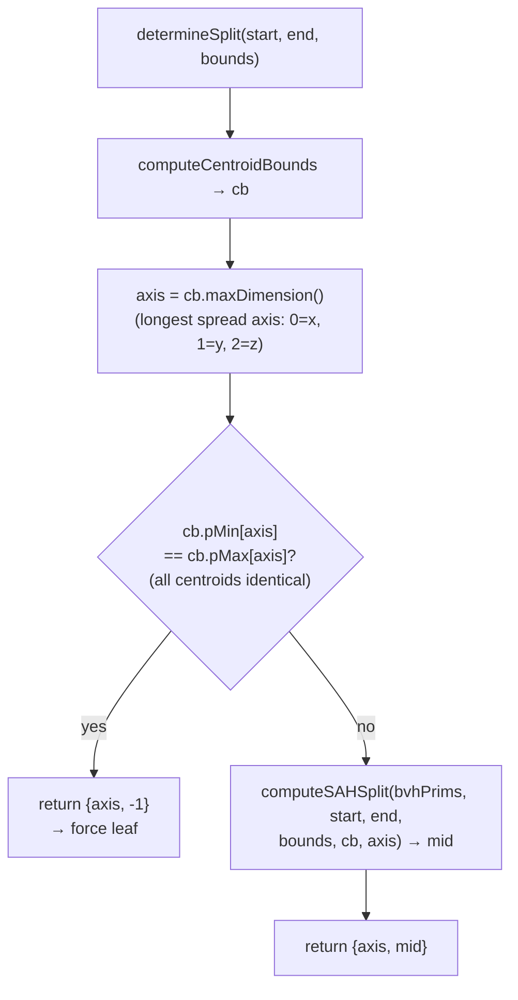

---

### computeSAHSplit — the full SAH pipeline in code

This function implements the entire bucket SAH algorithm from Section 6.

```cpp
int BvhAggregate::computeSAHSplit(std::vector<BVHPrimitive> &bvhPrimitives,
    int start, int end, const maths::Bounds3d &bounds,
    const maths::Bounds3d &centroidBounds, int axis)
{
    double lo     = centroidBounds.pMin.data()[axis];
    double extent = centroidBounds.pMax.data()[axis] - lo;
    auto buckets  = fillBuckets(bvhPrimitives, start, end, axis, lo, extent);
    auto costs    = computeSAHCosts(buckets, bounds.surfaceArea());
    int minSplit  = findMinCostSplit(costs);
    if (costs[minSplit] >= static_cast<double>(end - start))
        return -1;
    double splitPos = lo + (minSplit + 1) * extent / N_BUCKETS;
    return partitionPrims(bvhPrimitives, start, end, axis, splitPos);
}
```

#### fillBuckets

```cpp
auto BvhAggregate::fillBuckets(const std::vector<BVHPrimitive> &bvhPrimitives,
    int start, int end, int axis, double lo, double extent)
    -> std::array<BucketInfo, N_BUCKETS>
{
    std::array<BucketInfo, N_BUCKETS> buckets;
    for (int i = start; i < end; ++i) {
        const auto &prim = bvhPrimitives[i];
        updateBucket(buckets[bucketIndex(prim, axis, lo, extent)], prim.bounds);
    }
    return buckets;
}
```

`bucketIndex` implements the formula from Section 6:

```cpp
int BvhAggregate::bucketIndex(
    const BVHPrimitive &prim, int axis, double lo, double extent)
{
    int b = static_cast<int>(N_BUCKETS * (prim.centroid.data()[axis] - lo) / extent);
    return b == N_BUCKETS ? N_BUCKETS - 1 : b;
}
```

The clamp `b == N_BUCKETS ? N_BUCKETS - 1 : b` handles the edge case where
`centroid[axis] == lo + extent` exactly (rightmost primitive): the formula gives exactly
`N_BUCKETS`, which is out of range.

`updateBucket` expands the bucket's bounds and increments its count:

```cpp
void BvhAggregate::updateBucket(BucketInfo &bucket, const maths::Bounds3d &bounds)
{
    bucket.count++;
    if (!bucket.initialized) {
        bucket.bounds = bounds;
        bucket.initialized = true;
    } else {
        bucket.bounds = bucket.bounds.boundsUnion(bounds);
    }
}
```

#### accumulateBuckets

Used to sweep left-to-right (or right-to-left) across a range of buckets, computing the
union of all their bounds and the sum of their counts:

```cpp
std::pair<maths::Bounds3d, int> BvhAggregate::accumulateBuckets(
    const std::array<BucketInfo, N_BUCKETS> &buckets, int from, int to)
{
    maths::Bounds3d b;
    bool init = false;
    int count = 0;
    for (int j = from; j < to; ++j) {
        if (buckets[j].count == 0) continue;
        if (!init) { b = buckets[j].bounds; init = true; }
        else b = b.boundsUnion(buckets[j].bounds);
        count += buckets[j].count;
    }
    return {b, count};
}
```

Empty buckets (`count == 0`) are skipped. The `init` flag plays the same role as in
`BucketInfo`: the first non-empty bucket seeds the bounds rather than unioning with the
default inside-out box.

#### computeSAHCosts

```cpp
auto BvhAggregate::computeSAHCosts(
    const std::array<BucketInfo, N_BUCKETS> &buckets, double parentSA)
    -> std::array<double, N_BUCKETS - 1>
{
    std::array<double, N_BUCKETS - 1> cost;
    for (int i = 0; i < N_BUCKETS - 1; ++i) {
        auto [b0, c0] = accumulateBuckets(buckets, 0, i + 1);
        auto [b1, c1] = accumulateBuckets(buckets, i + 1, N_BUCKETS);
        double sa0 = c0 > 0 ? b0.surfaceArea() : 0.0;
        double sa1 = c1 > 0 ? b1.surfaceArea() : 0.0;
        cost[i] = 1.0 + (sa0 * c0 + sa1 * c1) / parentSA;
    }
    return cost;
}
```

This is the direct implementation of the cost formula from Section 5:

```
Cost(i) = 1 + (SA(L_i) · n_L_i + SA(R_i) · n_R_i) / SA(parent)
```

`sa0` is set to 0 when `c0 == 0` (empty left partition) to avoid using the uninitialized
bounds of the accumulator.

#### findMinCostSplit and the leaf guard

```cpp
int BvhAggregate::findMinCostSplit(const std::array<double, N_BUCKETS - 1> &costs)
{
    int minSplit = 0;
    for (int i = 1; i < N_BUCKETS - 1; ++i)
        if (costs[i] < costs[minSplit])
            minSplit = i;
    return minSplit;
}
```

A linear scan over 11 values — trivially fast.

Back in `computeSAHSplit`:

```cpp
if (costs[minSplit] >= static_cast<double>(end - start))
    return -1;
```

`end - start` is the cost of a leaf (one test per primitive, no traversal overhead). If
even the best split cannot beat the leaf, `−1` is returned and `buildRecursive` calls
`buildLeaf` instead.

#### Converting the winning bucket index to a world-space split position

```cpp
double splitPos = lo + (minSplit + 1) * extent / N_BUCKETS;
```

Split plane `i` lies between bucket `i` and bucket `i+1`. Its position on the axis is the
right boundary of bucket `i`:

```
splitPos = lo + (i + 1) · bucket_width
         = lo + (i + 1) · extent / N_BUCKETS
```

All primitives with `centroid[axis] < splitPos` will be placed in the left group.

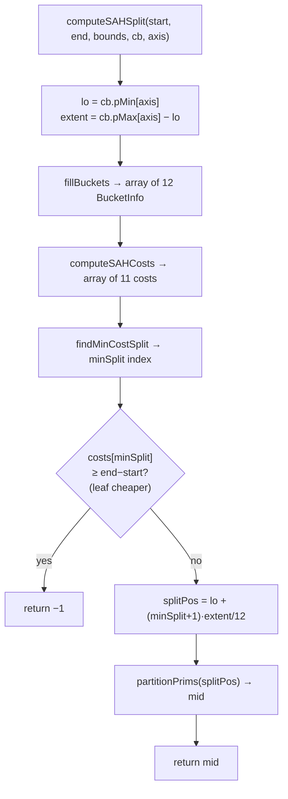

---

### Partitioning — reordering the primitive array

```cpp
int BvhAggregate::partitionPrims(std::vector<BVHPrimitive> &bvhPrimitives,
    int start, int end, int axis, double splitPos)
{
    auto *mid = std::partition(bvhPrimitives.data() + start,
        bvhPrimitives.data() + end, SplitPredicate{axis, splitPos});
    int midIdx = static_cast<int>(mid - bvhPrimitives.data());
    if (midIdx == start || midIdx == end) {
        midIdx = (start + end) / 2;
        std::nth_element(bvhPrimitives.data() + start,
            bvhPrimitives.data() + midIdx,
            bvhPrimitives.data() + end, CentroidAxisLess{axis});
    }
    return midIdx;
}
```

`std::partition` physically reorders `bvhPrimitives[start..end)` in place so that all
elements satisfying the predicate come first. It returns a pointer to the first element
that does **not** satisfy the predicate — the start of the right group.

```cpp
bool BvhAggregate::SplitPredicate::operator()(const BVHPrimitive &p) const
{
    return p.centroid.data()[axis] < splitPos;
}
```

**The degenerate fallback — `std::nth_element`**

If `std::partition` moves everything to one side (`midIdx == start` or `midIdx == end`),
the split degenerated: perhaps all centroids were assigned to one side of `splitPos`
despite being in different buckets (possible when two centroids differ by less than a
bucket width). Rather than creating an empty child, a **median split** is forced:

```cpp
std::nth_element(..., CentroidAxisLess{axis});
```

`std::nth_element` partially sorts the range so the element at position `midIdx` is the
one that would be there in a fully sorted array. Elements before it are ≤ it, elements
after are ≥ it, but neither sub-range is sorted. This is O(n) on average — cheaper than
a full sort.

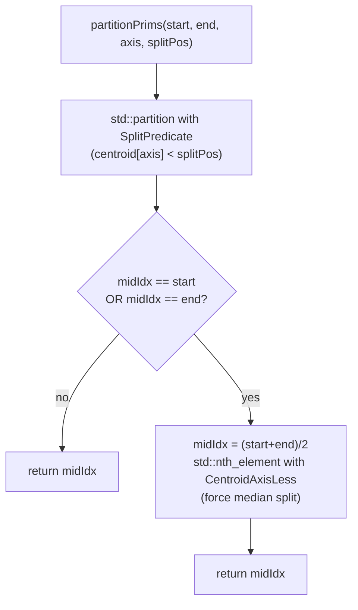

---

### buildLeaf

```cpp
BvhAggregate::BVHBuildNode *BvhAggregate::buildLeaf(BVHBuildNode *node,
    const maths::Bounds3d &bounds,
    const std::vector<BVHPrimitive> &bvhPrimitives, int start, int end,
    std::vector<IPrimitive *> &orderedPrims)
{
    int firstOffset = static_cast<int>(orderedPrims.size());
    for (int i = start; i < end; ++i)
        orderedPrims.push_back(
            _primitives[bvhPrimitives[i].primitiveIndex].get());
    node->initLeaf(firstOffset, end - start, bounds);
    return node;
}
```

The primitives in `[start, end)` are appended to `orderedPrims` in current order. The
leaf records `firstOffset` (the append position before the loop) and `end - start` (the
count). During traversal, `_orderedPrims[firstOffset .. firstOffset + nPrimitives)` gives
exactly this leaf's primitives.

---

## 10. Phase 2 — Flattening the Tree

### Why flatten?

A recursive `BVHBuildNode` tree is fine for building, but terrible for traversal
performance. Each node is a separately allocated deque element; traversing the tree means
following raw pointers that could be anywhere in memory, causing frequent cache misses.

The flat linear array packs every node contiguously. When the traversal loop reads
`_nodes[current]`, the hardware prefetcher can often predict and preload adjacent nodes.
More importantly, the **left child is always at `index + 1`** — the most frequently taken
path (continue descending) costs nothing more than incrementing an integer.

### Depth-first pre-order layout

`flattenBVH` performs a **depth-first, pre-order** traversal: visit the current node,
recurse left, recurse right. Nodes are written to the array in visit order.

```cpp
// BvhAggregate.cpp:125-141
int BvhAggregate::flattenBVH(BVHBuildNode *node, int *offset)
{
    LinearBVHNode *linearNode = &_nodes[*offset];
    linearNode->bounds        = node->bounds;
    int myOffset              = (*offset)++;          // reserve this slot
    if (node->nPrimitives > 0) {
        linearNode->primitivesOffset = node->firstPrimOffset;
        linearNode->nPrimitives      = static_cast<uint16_t>(node->nPrimitives);
        linearNode->axis             = 0;
    } else {
        linearNode->axis        = static_cast<uint8_t>(node->splitAxis);
        linearNode->nPrimitives = 0;
        flattenBVH(node->children[0], offset);         // left child immediately after
        linearNode->secondChildOffset = flattenBVH(node->children[1], offset);
    }
    return myOffset;
}
```

The key line: `flattenBVH(node->children[0], offset)` is called **before**
`flattenBVH(node->children[1], offset)`. This means the left child occupies the slot
right after the parent (`myOffset + 1`). The right child goes wherever the offset
points after the entire left subtree is flattened — that index is stored in
`secondChildOffset`.

### Concrete example

Consider a tree of 7 nodes. Pre-order traversal visits: Root → LeftInterior → LeafA →
LeafB → RightInterior → LeafC → LeafD.

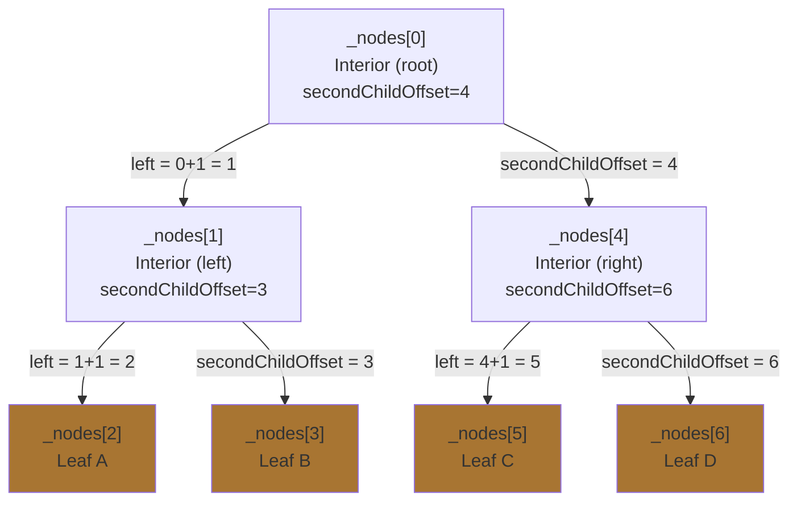

Memory layout:

```
Index:  [ 0      ][ 1      ][ 2    ][ 3    ][ 4       ][ 5    ][ 6    ]
        [ Root   ][ LeftI  ][ Leaf ][ Leaf ][ RightI  ][ Leaf ][ Leaf ]
```

To visit the left child of node 0: `current = current + 1 = 1` (free).
To visit the right child of node 0: `current = _nodes[0].secondChildOffset = 4`.

```mermaid
flowchart TD
    A["flattenBVH(node, offset)"] --> B["linearNode = &_nodes[*offset]\nlinearNode->bounds = node->bounds\nmyOffset = (*offset)++"]
    B --> C{nPrimitives > 0?}
    C -- yes --> D["Leaf:\nprimitivesOffset = firstPrimOffset\nnPrimitives = n\naxis = 0"]
    C -- no --> E["Interior:\naxis = splitAxis\nnPrimitives = 0"]
    E --> F["flattenBVH(children[0], offset)\n← left child lands at myOffset+1"]
    F --> G["secondChildOffset = flattenBVH(children[1], offset)\n← right child lands after full left subtree"]
    D --> H["return myOffset"]
    G --> H
```

---

## 11. Traversal

### Ray setup

Before the traversal loop, two derived quantities are computed **once** and reused for
every box test:

```cpp
std::pair<maths::Vector3d, std::array<int, 3>> BvhAggregate::computeRaySetup(
    const maths::Ray &ray)
{
    auto inv = computeInvDir(ray);
    return {inv, computeDirNegMask(inv)};
}

maths::Vector3d BvhAggregate::computeInvDir(const maths::Ray &ray)
{
    return {1.0 / ray.direction.x(), 1.0 / ray.direction.y(),
        1.0 / ray.direction.z()};
}

std::array<int, 3> BvhAggregate::computeDirNegMask(const maths::Vector3d &invDir)
{
    return {static_cast<int>(invDir.x() < 0),
            static_cast<int>(invDir.y() < 0),
            static_cast<int>(invDir.z() < 0)};
}
```

`invDir` turns the slab divisions into multiplications (see Section 3). `dirIsNeg[i]`
is `1` if the ray travels in the negative direction on axis `i`, and `0` otherwise.

`dirIsNeg` serves two purposes:

1. **Inside `Bounds3::intersectP`:** selects whether `pMin` or `pMax` gives the near slab
   entry for each axis, without branching (`bounds[dirIsNeg[i]]` for near,
   `bounds[1 - dirIsNeg[i]]` for far).

2. **Inside `advanceToChild`:** determines which child to visit first. When a ray travels
   in the negative direction on the split axis, the child with higher coordinates
   (stored as `secondChildOffset`) is geometrically closer, so it is visited first to
   increase the chance of finding a closer hit early — making it possible to prune the
   other child sooner.

---

### intersect / traverseForHit

`intersect` is the **closest hit** query. It must find the closest intersection along the
ray, not just any intersection.

```cpp
std::optional<shape::SurfaceInteraction> BvhAggregate::intersect(
    const maths::Ray &ray) const
{
    if (!_nodes) return std::nullopt;
    return traverseForHit(ray);
}
```

```cpp
std::optional<shape::SurfaceInteraction> BvhAggregate::traverseForHit(
    const maths::Ray &ray) const
{
    auto [inv, dirIsNeg] = computeRaySetup(ray);
    std::optional<shape::SurfaceInteraction> bestHit;
    std::array<int, 64> stack;
    int toVisit = 0, current = 0;
    while (true) {
        const LinearBVHNode &node = _nodes[current];
        bool hit                  = node.bounds.intersectP(ray, inv, dirIsNeg);
        if (hit && node.nPrimitives > 0) {
            processLeafHit(node, ray, bestHit);
            if (!popStack(stack, toVisit, current)) break;
        } else if (hit) {
            advanceToChild(node, dirIsNeg, stack, toVisit, current);
        } else if (!popStack(stack, toVisit, current)) {
            break;
        }
    }
    return bestHit;
}
```

The traversal uses an **explicit stack** of node indices (`int[64]`). Recursion is avoided
because the call stack depth for 64-bit indices would exceed millions of nodes — far
beyond any real scene. A stack depth of 64 is sufficient for a tree with up to 2^64
leaves.

| Condition | Action |
|-----------|--------|
| AABB hit + leaf | Test all primitives in the leaf; update `bestHit`; pop stack |
| AABB hit + interior | Push far child to stack; advance to near child |
| AABB miss | Pop stack |
| Stack empty | End traversal |

```cpp
void BvhAggregate::advanceToChild(const LinearBVHNode &node,
    const std::array<int, 3> &dirIsNeg,
    std::array<int, 64> &stack, int &toVisit, int &current)
{
    if (dirIsNeg[node.axis]) {
        stack[toVisit++] = current + 1;      // defer left child
        current = node.secondChildOffset;    // visit right child first
    } else {
        stack[toVisit++] = node.secondChildOffset;  // defer right child
        current = current + 1;                      // visit left child first
    }
}
```

The near/far ordering is an optimisation: by visiting the geometrically closer child
first, we are more likely to find a hit early, which tightens `ray.tMax` and lets
subsequent AABB tests reject the far child cheaply.

```cpp
void BvhAggregate::processLeafHit(const LinearBVHNode &node,
    const maths::Ray &ray,
    std::optional<shape::SurfaceInteraction> &bestHit) const
{
    for (int i = 0; i < node.nPrimitives; ++i) {
        auto hit = _orderedPrims[node.primitivesOffset + i]->intersect(ray);
        if (hit) bestHit = hit;
    }
}
```

```mermaid
flowchart TD
    A["traverseForHit(ray)"] --> B["computeRaySetup → inv, dirIsNeg\nstack=[], current=0, bestHit=nullopt"]
    B --> C["node = _nodes[current]\nhit = bounds.intersectP(ray,inv,dirIsNeg)"]
    C --> D{hit?}
    D -- no --> E["popStack → current"]
    E --> F{stack empty?}
    F -- yes --> G["return bestHit"]
    F -- no --> C
    D -- yes --> H{nPrimitives > 0?\nleaf}
    H -- yes --> I["processLeafHit\n(update bestHit for each primitive hit)\npopStack → current"]
    I --> F
    H -- no --> J["advanceToChild\n(push far child, set current = near child)"]
    J --> C
```

---

### intersectP / traverseForAnyHit

`intersectP` is the **shadow ray** test. It asks *does anything block this ray?* and
returns as soon as **any** hit is found.

```cpp
bool BvhAggregate::intersectP(const maths::Ray &ray) const
{
    if (!_nodes) return false;
    return traverseForAnyHit(ray);
}
```

```cpp
bool BvhAggregate::traverseForAnyHit(const maths::Ray &ray) const
{
    auto [inv, dirIsNeg] = computeRaySetup(ray);
    std::array<int, 64> stack;
    int toVisit = 0, current = 0;
    while (true) {
        const LinearBVHNode &node = _nodes[current];
        bool hit                  = node.bounds.intersectP(ray, inv, dirIsNeg);
        if (hit && node.nPrimitives > 0) {
            if (anyHitInLeaf(node, ray))
                return true;      // short-circuit: found a blocker
        } else if (hit) {
            advanceToChild(node, dirIsNeg, stack, toVisit, current);
            continue;
        }
        if (!popStack(stack, toVisit, current))
            break;
    }
    return false;
}
```

```cpp
bool BvhAggregate::anyHitInLeaf(
    const LinearBVHNode &node, const maths::Ray &ray) const
{
    for (int i = 0; i < node.nPrimitives; ++i)
        if (_orderedPrims[node.primitivesOffset + i]->intersectP(ray))
            return true;
    return false;
}
```

The structure is identical to `traverseForHit` except:
- It calls `intersectP` on each primitive (cheaper — no need to compute the full
  `SurfaceInteraction`).
- It returns `true` immediately on the first primitive hit.
- No `bestHit` accumulator is needed.

---

## 12. Memory Model and RAII

```mermaid
classDiagram
    class BvhAggregate {
        -int _maxPrimsInNode
        -vector~unique_ptr~IPrimitive~~ _primitives
        -unique_ptr~LinearBVHNode[]~ _nodes
        -vector~IPrimitive*~ _orderedPrims
    }
    note for BvhAggregate "_primitives:  owns all leaf IPrimitive objects (deep ownership)\n_nodes:       owns the flat traversal array (RAII, freed on destroy)\n_orderedPrims: non-owning raw pointers into _primitives (always valid)\n\nLocal to constructor (freed automatically on scope exit):\n  deque~BVHBuildNode~ nodePool\n  vector~BVHPrimitive~ bvhPrimitives"
```

| Object | Owner | Lifetime |
|--------|-------|---------|
| `_primitives` | `BvhAggregate` (`unique_ptr`) | Lives as long as the aggregate |
| `_nodes` | `BvhAggregate` (`unique_ptr<T[]>`) | Lives as long as the aggregate; freed in destructor |
| `_orderedPrims` | Observer (raw `T*`) | Points into `_primitives`; always valid |
| `nodePool` (local) | Constructor scope (`deque`) | Freed when constructor returns |
| `bvhPrimitives` (local) | Constructor scope (`vector`) | Freed when constructor returns |

No destructor is needed in `BvhAggregate` — `unique_ptr` handles both `_primitives` and
`_nodes`, and the raw pointers in `_orderedPrims` are observers that do not own anything.

---

## 13. Complete Call Graph

```mermaid
flowchart TD
    Ctor["BvhAggregate(primitives, maxPrimsInNode)"]

    Ctor --> BR["buildRecursive(nodePool, bvhPrims, start, end, orderedPrims)"]
    BR --> CPB["computePrimBounds(start, end)"]
    BR --> DS["determineSplit(start, end, bounds)"]
    DS --> CCB["computeCentroidBounds(start, end)"]
    DS --> SAHS["computeSAHSplit(start, end, bounds, cb, axis)"]
    SAHS --> FB["fillBuckets(start, end, axis, lo, extent)"]
    FB --> BI["bucketIndex(prim, axis, lo, extent)"]
    FB --> UB["updateBucket(bucket, bounds)"]
    SAHS --> SAHC["computeSAHCosts(buckets, parentSA)"]
    SAHC --> AB["accumulateBuckets(from, to)"]
    SAHS --> FMC["findMinCostSplit(costs)"]
    SAHS --> PP["partitionPrims(start, end, axis, splitPos)"]
    PP -->|"std::partition"| SP["SplitPredicate::operator()"]
    PP -->|"fallback: std::nth_element"| CAL["CentroidAxisLess::operator()"]
    BR --> BL["buildLeaf(node, bounds, start, end, orderedPrims)"]
    Ctor --> FlatBVH["flattenBVH(root, &offset)"]

    subgraph "Traversal"
        direction TB
        INT["intersect(ray)"] --> TFH["traverseForHit(ray)"]
        TFH --> CRS["computeRaySetup(ray)"]
        CRS --> CID["computeInvDir(ray)"]
        CRS --> CDN["computeDirNegMask(invDir)"]
        TFH --> BAABB["Bounds3::intersectP(ray, inv, dirIsNeg)"]
        TFH --> PLH["processLeafHit(node, ray, bestHit)"]
        TFH --> ATC["advanceToChild(node, dirIsNeg, stack, toVisit, current)"]
        TFH --> PS["popStack(stack, toVisit, current)"]

        INTP["intersectP(ray)"] --> TFAH["traverseForAnyHit(ray)"]
        TFAH --> CRS
        TFAH --> BAABB
        TFAH --> AHIL["anyHitInLeaf(node, ray)"]
        TFAH --> ATC
        TFAH --> PS
    end
```

---

## Summary

```
Input primitives
      │
      ▼
BVHPrimitive wrappers (precompute worldBound + centroid)
      │
      ▼
buildRecursive — divide and conquer
  │
  ├── computePrimBounds      → bounds of current group (for SAH parent SA)
  ├── computeCentroidBounds  → bounds of centroids (for axis selection + bucket range)
  ├── determineSplit
  │     ├── choose axis = longest centroid spread
  │     ├── degenerate check (all centroids coincide → force leaf)
  │     └── computeSAHSplit
  │           ├── fillBuckets   → assign each primitive to one of 12 buckets by centroid
  │           ├── computeSAHCosts → evaluate  Cost(i) = 1 + (SA_L·n_L + SA_R·n_R)/SA_parent
  │           ├── findMinCostSplit → pick i with minimum cost
  │           ├── leaf guard    → if min cost ≥ n, return -1 (leaf cheaper)
  │           └── partitionPrims → reorder array so [start,mid)=left, [mid,end)=right
  └── buildLeaf → append to orderedPrims, call node->initLeaf
      │
      ▼
deque<BVHBuildNode> — pointer-stable temporary tree
      │
      ▼
flattenBVH — depth-first pre-order layout
  Left child always at index+1; right child at secondChildOffset
      │
      ▼
unique_ptr<LinearBVHNode[]> — cache-aligned contiguous array
      │
      ▼
Stack-based traversal (explicit int[64] stack, no recursion)
  intersect  → traverseForHit  : find closest hit  (processLeafHit accumulates)
  intersectP → traverseForAnyHit : find any hit     (anyHitInLeaf short-circuits)
  Both use precomputed invDir + dirIsNeg for branchless slab tests
```
